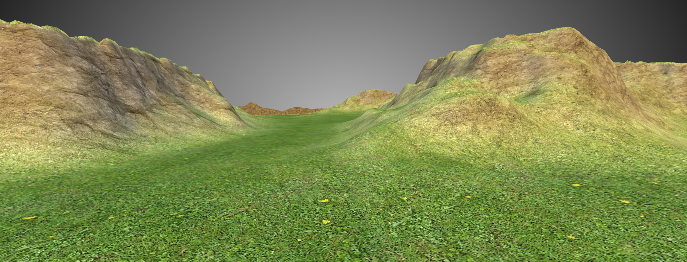

# triPlanarTexturing example

## Motivation

Triplanar texturing is a world-space texturing technique. It is especially useful for large-scale landscape models, or for static, generative geometry, where texture coordinates cannot be calculated.

It's also very cheap on texture memory, but will lead to three texture lookups per fragment.

# Main technique

This example goes through the necessary steps for setting up a triplanar texturing shader.

# Sub-topics 

	* Discuss difference between eye space and world space 
	* Show how to transform from eye space back into world space
	* Show and compare two alternatives of how to calculate normalMatrix
	* Discuss Space in which normals are expressed
	* Show mipmapping in action
	* Discuss backface culling and glFrontFace
	* Demonstrate visual debugging

# Common patterns
	
	* "Dirty Shader"
	* oF shader includes

# Note

## Assets

You can place three seamless textures into `data/assets/`, and name them:

	* grass.jpg
	* dirt.jpg
	* rock.jpg

You might find some textures [here](http://www.proceduraltextures.com/2013/11/21/creating-a-procedural-land-texture-with-images/).

## Screenshot

